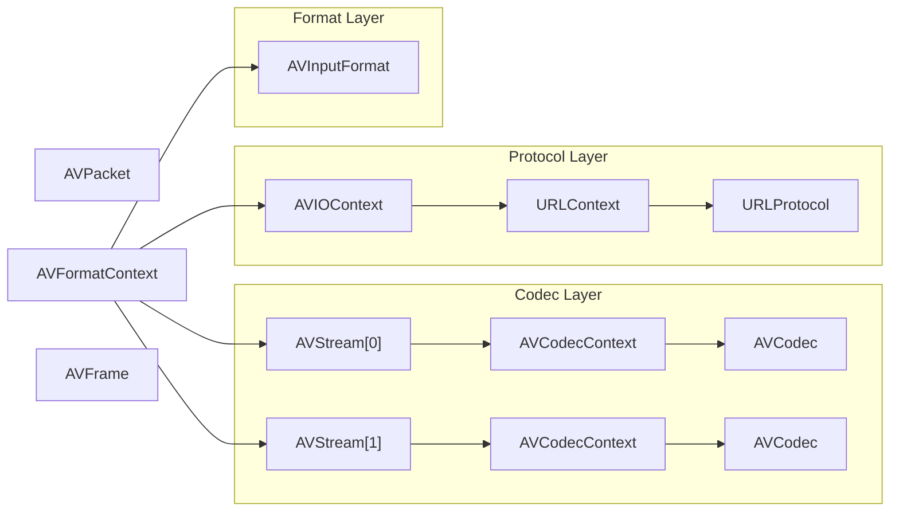

# FFMpeg中关键数据结构之间的关系



- 每个AVStream存储一个视频/音频流的相关数据；
- 每个AVStream对应一个AVCodecContext，存储该视频/音频流使用解码方式的相关数据；
- 每个AVCodecContext中对应一个AVCodec，包含该视频/音频对应的解码器。
- 每种解码器都对应一个AVCodec结构。

# 数据结构的动态和静态关系

URLProtocol和URLContext、AVInputFormat和AVFormatContext、AVCodec和AVCodecContext

Context结构将多种类型的广义数据的共同部分抽象出来，着重于动态性，其核心成员只能在程序运行时动态确定其值。并且接口类的数据结构在运行时有多个实例，而相应的Context类只有一个实例，同时体现了数据结构的划分原则，如果有一对多的关系就要分开定义。

# 数据结构解析
## AVInputFormat/AVFormatContext/AVIContext

分析AVInputFormat/AVFormatContext/AVIContext 三个结构体之间的关系。

AVFormatContext父类

AVInputFormat接口类，libavformat/avidec.c实现了avi封装器的接口。

AVIContext 子类，包含指向父类的指针以及子类特有属性。

AVFormatContext通过AVInputFormat调用avidec封装器的函数，设置AVIContext 特有属性和AVFormatContext通用属性。


```c
// libavformat/avformat.h
typedef struct AVFormatContext {
    /**
     * The input container format.
     *
     * Demuxing only, set by avformat_open_input().
     */
    ff_const59 struct AVInputFormat *iformat;

    /**
     * The output container format.
     *
     * Muxing only, must be set by the caller before avformat_write_header().
     */
    ff_const59 struct AVOutputFormat *oformat;

    /**
     * Format private data. This is an AVOptions-enabled struct
     * if and only if iformat/oformat.priv_class is not NULL.
     *
     * - muxing: set by avformat_write_header()
     * - demuxing: set by avformat_open_input()
     */
    void *priv_data; // AVIContext
} AVFormatContext;
// AVInputFormat和AVOutputFormat是互斥的，同一个实例只能是其中一个。

typedef struct AVInputFormat {
    const AVClass *priv_class; ///< AVClass for the private context
} AVInputFormat;

static const AVInputFormat * const demuxer_list[] = {
	&ff_avi_demuxer,
}

// libavformat/avidec.c
typedef struct AVIContext {
    const AVClass *class;
} AVIContext;

AVInputFormat ff_avi_demuxer = {
    .name           = "avi",
    .long_name      = NULL_IF_CONFIG_SMALL("AVI (Audio Video Interleaved)"),
    .priv_data_size = sizeof(AVIContext),
    .extensions     = "avi",
    .read_probe     = avi_probe,
    .read_header    = avi_read_header,
    .read_packet    = avi_read_packet,
    .read_close     = avi_read_close,
    .read_seek      = avi_read_seek,
    .priv_class = &demuxer_class,
};
```

## URLProtocol/URLContext/AVIOContext/HTTPContext

URLContext通过URLProtocol调用http的函数，设置HTTPContext特有属性和URLContext通用属性。

AVIOContext在此之上，包含了opaque指针，可以指向URLContext使用对应URL的实现，也可以自定义结构体，实现read、write等函数。

```c
// libavformat/url.h
typedef struct URLContext {
    const AVClass *av_class;    /**< information for av_log(). Set by url_open(). */
    const struct URLProtocol *prot; // 广义输入文件
    void *priv_data;  // 文件句柄fd，网络通信socket等
} URLContext;

typedef struct URLProtocol {
    int     (*url_open)( URLContext *h, const char *url, int flags);
    const AVClass *priv_data_class;
    int priv_data_size;
} URLProtocol;
// libavformat/avio.h
typedef struct AVIOContext {
    void *opaque; // passed to the read/write/seek/...functions.
} AVIOContext;
// opaque 来完成广义文件读写操作。 opaque 关联字段用于关联URLContext 结构，间接关联并扩展URLProtocol结构

// libavformat/protocols.c
const URLProtocol *up = url_protocols[i];
// libavformat/protocol_list.c
static const URLProtocol * const url_protocols[] = {
    &ff_http_protocol,
};
```


## AVCodec/AVCodecContext/MsrleContext

分析AVCodec/AVCodecContext/MsrleContext三个结构体之间的关系。

AVCodecContext父类

AVCodec接口类，libavcodec/msrle.c实现了Msrle解码器的接口。

MsrleContext子类，包含指向父类的指针以及子类特有属性。

AVCodecContext通过AVCodec调用Msrle解码器的函数，设置MsrleContext特有属性和AVCodecContext通用属性。


```c
typedef struct AVCodecContext{ // 类似父类
    void *priv_data;// 子类的私有options，可以没有
    const struct AVCodec  *codec;
}AVCodecContext;

// libavcodec/options.c
s->priv_data= av_mallocz(codec->priv_data_size);
*(const AVClass**)s->priv_data = codec->priv_class;
// 获取AVCodecContext需要传入一个codec
// dec_ctx = avcodec_alloc_context3(dec);

typedef struct AVCodec { // 类似接口
    const AVClass *priv_class;
    int priv_data_size;
} AVCodec;

// libavcodec/allcodecs.c 通过codec_id获取对应解码器的context
dec = avcodec_find_decoder(st->codecpar->codec_id);
const AVCodec *c = codec_list[i];
// libavcodec/codec_list.c
static const AVCodec * const codec_list[] = {
    &ff_msrle_decoder,
}

// libavcodec/msrle.c 具体的解码器的context
typedef struct MsrleContext { // 类似子类
    AVCodecContext *avctx; // 类似父类，通用属性和函数
    AVFrame *frame;

    GetByteContext gb;

    uint32_t pal[256]; // 私有属性
} MsrleContext;

AVCodec ff_msrle_decoder = {
    .name           = "msrle",
    .long_name      = NULL_IF_CONFIG_SMALL("Microsoft RLE"),
    .type           = AVMEDIA_TYPE_VIDEO,
    .id             = AV_CODEC_ID_MSRLE,
    .priv_data_size = sizeof(MsrleContext),
    .init           = msrle_decode_init,
    .close          = msrle_decode_end,
    .decode         = msrle_decode_frame,
    .flush          = msrle_decode_flush,
    .capabilities   = AV_CODEC_CAP_DR1,
};
```

## AVStream/AVIStream/AVCodecParameters

AVStream 结构表示当前媒体流的上下文context， 着重于所有媒体流共有的属性(并且是在程序运行时才能确定其值)和关联其他结构的字段。 

codecpar 字段关联当前音视频媒体使用的编解码器； priv_data 字段关联解析各个具体媒体流与文件容器有关的独有的属性；还有一些媒体帧索引和时钟信息  

与之前两个不同，这类结构体没有定义函数，都是stream属性

```c
// demux时候获取stream
avformat_open_input
	-> s->iformat->read_header(s))
    
typedef struct AVStream {
    void *priv_data; //AVIStream
	AVCodecParameters *codecpar;// 编码器的参数
}
```

## AVPacket/AVPacketList/AVFrame

```c
typedef struct AVPacket {
    /**
     * A reference to the reference-counted buffer where the packet data is
     * stored.
     * May be NULL, then the packet data is not reference-counted.
     */
    AVBufferRef *buf;
} AVPacket;
// AVPacket 代表音视频数据帧，固有的属性是一些标记，时钟信息，和压缩数据首地址，大小等信息

typedef struct AVPacketList {
    AVPacket pkt;
    struct AVPacketList *next;
} AVPacketList;
// AVPacketList 把音视频AVPacket 组成一个小链表

typedef struct AVFrame {
} AVFrame;
// 解码后的一帧数据
```
## AVUtil :工具类
- AVLog：日志输出
- AVOption (AVClass)：选项设置，用ffmpeg查询支持哪些AVOption。例如：ffmpeg -h filter=volume。
- AVDictionary：键值对存储
- ParseUtil：字符串解析

## AVFilter：音视频滤镜

