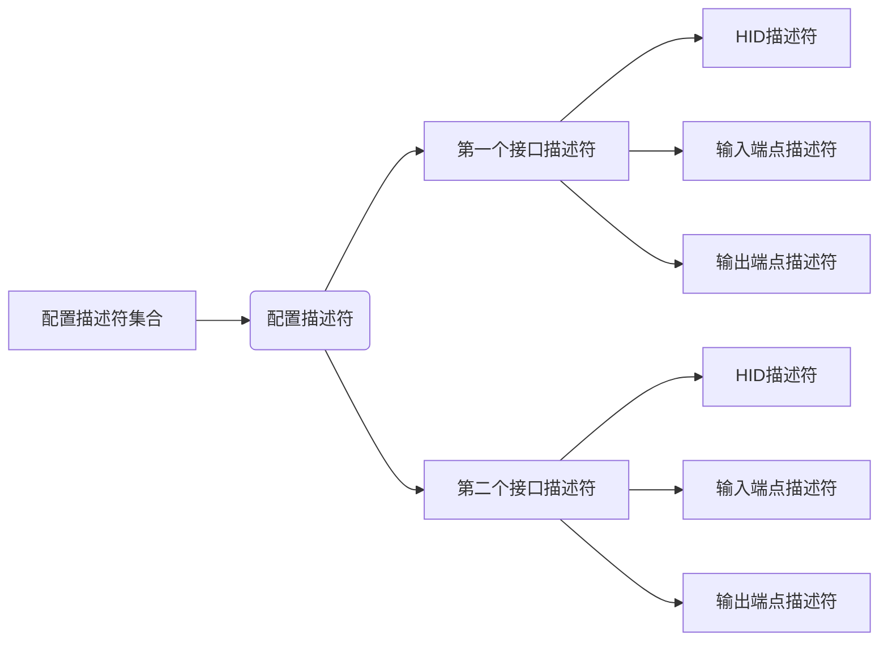

# USB笔记3_复合设备

本篇主要浅谈支持多功能的设备。
至少有两种方法能够实现：
1. 只是用一个接口，但是使用两个应用集合和两个报告。
2. 使用两个接口，一个接口实现键盘功能，另一个接口实现鼠标功能。

## 方法一：一个接口、两个集合、两个报告

通过修改报告描述符实现。一个描述符中可以具有多个外层应用集合，而系统软件就是通过分析外层应用集合的功能来增加不通的设备和驱动的。因此在这里，只需要实现用途分别为键盘和鼠标的两个应用集合即可。同时，每个应用集合里还需要增加一个报告ID，以区分返回数据。报告ID是报告输入或者输出时的第一个字节，当没有定义报告ID时，报告前面就没有报告ID。对于返回的没有报告ID的报告，人体学输入设备驱动会自动增加一个报告ID 0；而应用程序在发送数据出去时，也要带一个值为0的报告ID。人体学输入设备驱动会自动去掉这个值为0的报告ID，只发送数据出去。
注意：报告ID一旦定义，输入报告和输出报告的第一字节都是报告ID。例如：本例中的键盘，从端点1读输出报告数据时要读2字节的数据，第一字节为报告ID，第二字节才是真正的报告数据。
```text
//USB报告描述符的定义
//该报告描述符定义了两个顶层应用集合——键盘和鼠标。
code uint8 ReportDescriptor[]=
{
 //每行开始的第一字节为该条目的前缀，前缀的格式为：
 //D7~D4：bTag。D3~D2：bType；D1~D0：bSize。以下分别对每个条目注释。
 
/************************USB键盘部分报告描述符**********************/
/*******************************************************************/
 //这是一个全局（bType为1）条目，将用途页选择为普通桌面Generic Desktop Page(0x01)
 //后面跟一字节数据（bSize为1），后面的字节数就不注释了，
 //自己根据bSize来判断。
 0x05, 0x01, // USAGE_PAGE (Generic Desktop)
 
 //这是一个局部（bType为2）条目，说明接下来的集合用途用于键盘
 0x09, 0x06, // USAGE (Keyboard)
 
 //这是一个主条目（bType为0）条目，开集合，后面跟的数据0x01表示
 //该集合是一个应用集合。它的性质在前面由用途页和用途定义为
 //普通桌面用的键盘。
 0xa1, 0x01, // COLLECTION (Application)
 
 //报告ID，这里定义键盘报告的ID为1（报告ID 0是保留的）
 0x85, 0x01, //Report ID (1)
 
 //这是一个全局条目，选择用途页为键盘（Keyboard/Keypad(0x07)）
 0x05, 0x07, //     USAGE_PAGE (Keyboard/Keypad)

 //这是一个局部条目，说明用途的最小值为0xe0。实际上是键盘左Ctrl键。
 //具体的用途值可在HID用途表中查看。
 0x19, 0xe0, //     USAGE_MINIMUM (Keyboard LeftControl)
 
 //这是一个局部条目，说明用途的最大值为0xe7。实际上是键盘右GUI键。
 0x29, 0xe7, //     USAGE_MAXIMUM (Keyboard Right GUI)
 
 //这是一个全局条目，说明返回的数据的逻辑值（就是我们返回的数据域的值）
 //最小为0。因为我们这里用Bit来表示一个数据域，因此最小为0，最大为1。
 0x15, 0x00, //     LOGICAL_MINIMUM (0)
 
 //这是一个全局条目，说明逻辑值最大为1。
 0x25, 0x01, //     LOGICAL_MAXIMUM (1)
 
 //这是一个全局条目，说明数据域的数量为八个。
 0x95, 0x08, //     REPORT_COUNT (8)
 
 //这是一个全局条目，说明每个数据域的长度为1个bit。
 0x75, 0x01, //     REPORT_SIZE (1)
 
 //这是一个主条目，说明有8个长度为1bit的数据域（数量和长度
 //由前面的两个全局条目所定义）用来做为输入，
 //属性为：Data,Var,Abs。Data表示这些数据可以变动，Var表示
 //这些数据域是独立的，每个域表示一个意思。Abs表示绝对值。
 //这样定义的结果就是，当某个域的值为1时，就表示对应的键按下。
 //bit0就对应着用途最小值0xe0，bit7对应着用途最大值0xe7。
 0x81, 0x02, //     INPUT (Data,Var,Abs)
 
 //这是一个全局条目，说明数据域数量为1个
 0x95, 0x01, //     REPORT_COUNT (1)
 
 //这是一个全局条目，说明每个数据域的长度为8bit。
 0x75, 0x08, //     REPORT_SIZE (8)
 
 //这是一个主条目，输入用，由前面两个全局条目可知，长度为8bit，
 //数量为1个。它的属性为常量（即返回的数据一直是0）。
 //该字节是保留字节（保留给OEM使用）。
 0x81, 0x03, //     INPUT (Cnst,Var,Abs)
 
 //这是一个全局条目。定义位域数量为6个。
 0x95, 0x06, //   REPORT_COUNT (6)
 
 //这是一个全局条目。定义每个位域长度为8bit。
 //其实这里这个条目不要也是可以的，因为在前面已经有一个定义
 //长度为8bit的全局条目了。
 0x75, 0x08, //   REPORT_SIZE (8)
 
 //这是一个全局条目，定义逻辑最小值为0。
 //同上，这里这个全局条目也是可以不要的，因为前面已经有一个
 //定义逻辑最小值为0的全局条目了。
 0x15, 0x00, //   LOGICAL_MINIMUM (0)
 
 //这是一个全局条目，定义逻辑最大值为255。
 0x25, 0xFF, //   LOGICAL_MAXIMUM (255)
 
 //这是一个全局条目，选择用途页为键盘。
 //前面已经选择过用途页为键盘了，所以该条目不要也可以。
 0x05, 0x07, //   USAGE_PAGE (Keyboard/Keypad)
 
 //这是一个局部条目，定义用途最小值为0（0表示没有键按下）
 0x19, 0x00, //   USAGE_MINIMUM (Reserved (no event indicated))
 
 //这是一个局部条目，定义用途最大值为0x65
 0x29, 0x65, //   USAGE_MAXIMUM (Keyboard Application)
 
 //这是一个主条目。它说明这六个8bit的数据域是输入用的，
 //属性为：Data,Ary,Abs。Data说明数据是可以变的，Ary说明
 //这些数据域是一个数组，即每个8bit都可以表示某个键值，
 //如果按下的键太多（例如超过这里定义的长度或者键盘本身无法
 //扫描出按键情况时），则这些数据返回全1（二进制），表示按键无效。
 //Abs表示这些值是绝对值。
 0x81, 0x00, //     INPUT (Data,Ary,Abs)

 //以下为输出报告的描述
 //逻辑最小值前面已经有定义为0了，这里可以省略。 
 //这是一个全局条目，说明逻辑值最大为1。
 0x25, 0x01, //     LOGICAL_MAXIMUM (1)
 
 //这是一个全局条目，说明数据域数量为5个。 
 0x95, 0x05, //   REPORT_COUNT (5)
 
 //这是一个全局条目，说明数据域的长度为1bit。
 0x75, 0x01, //   REPORT_SIZE (1)
 
 //这是一个全局条目，说明使用的用途页为指示灯（LED）
 0x05, 0x08, //   USAGE_PAGE (LEDs)
 
 //这是一个局部条目，说明用途最小值为数字键盘灯。
 0x19, 0x01, //   USAGE_MINIMUM (Num Lock)
 
 //这是一个局部条目，说明用途最大值为Kana灯。
 0x29, 0x05, //   USAGE_MAXIMUM (Kana)
 
 //这是一个主条目。定义输出数据，即前面定义的5个LED。
 0x91, 0x02, //   OUTPUT (Data,Var,Abs)
 
 //这是一个全局条目。定义位域数量为1个。
 0x95, 0x01, //   REPORT_COUNT (1)
 
 //这是一个全局条目。定义位域长度为3bit。
 0x75, 0x03, //   REPORT_SIZE (3)
 
 //这是一个主条目，定义输出常量，前面用了5bit，所以这里需要
 //3个bit来凑成一字节。
 0x91, 0x03, //   OUTPUT (Cnst,Var,Abs)
 
 //下面这个主条目用来关闭前面的集合。bSize为0，所以后面没数据。
 0xc0,        // END_COLLECTION
//以下注释不包括第一字节报告ID。
//通过上面的报告描述符的定义，我们知道返回的输入报告具有8字节。
//第一字节的8个bit用来表示特殊键是否按下（例如Shift、Alt等键）。
//第二字节为保留值，值为常量0。第三到第八字节是一个普通键键值的
//数组，当没有键按下时，全部6个字节值都为0。当只有一个普通键按下时，
//这六个字节中的第一字节值即为该按键的键值（具体的键值请看HID的
//用途表文档），当有多个普通键同时按下时，则同时返回这些键的键值。
//如果按下的键太多，则这六个字节都为0xFF（不能返回0x00，这样会让
//操作系统认为所有键都已经释放）。至于键值在数组中的先后顺序是
//无所谓的，操作系统会负责检查是否有新键按下。我们应该在中断端点1
//中按照上面的格式返回实际的键盘数据。另外，报告中还定义了一个字节
//的输出报告，是用来控制LED情况的。只使用了低7位，高1位是保留值0。
//当某位的值为1时，则表示对应的LED要点亮。操作系统会负责同步各个
//键盘之间的LED，例如你有两块键盘，一块的数字键盘灯亮时，另一块
//也会跟着亮。键盘本身不需要判断各种LED应该何时亮，它只是等待主机
//发送报告给它，然后根据报告值来点亮相应的LED。我们在端点1输出中断
//中读出这1字节的输出报告，然后对它取反（因为学习板上的LED是低电平时
//亮），直接发送到LED上。这样main函数中按键点亮LED的代码就不需要了。

/************************USB鼠标部分报告描述符**********************/
/*******************************************************************/

 //这是一个全局（bType为1）条目，选择用途页为普通桌面Generic Desktop Page(0x01)
 0x05, 0x01, // USAGE_PAGE (Generic Desktop)
 
 //这是一个局部（bType为2）条目，说明接下来的应用集合用途用于鼠标
 0x09, 0x02, // USAGE (Mouse)
 
 //这是一个主条目（bType为0）条目，开集合，后面跟的数据0x01表示
 //该集合是一个应用集合。它的性质在前面由用途页和用途定义为
 //普通桌面用的鼠标。
 0xa1, 0x01, // COLLECTION (Application)
 
 //报告ID，这里定义鼠标报告的ID为2
 0x85, 0x02, //Report ID (2)
 
 //这是一个局部条目。说明用途为指针集合
 0x09, 0x01, //   USAGE (Pointer)
 
 //这是一个主条目，开集合，后面跟的数据0x00表示该集合是一个
 //物理集合，用途由前面的局部条目定义为指针集合。
 0xa1, 0x00, //   COLLECTION (Physical)
 
 //这是一个全局条目，选择用途页为按键（Button Page(0x09)）
 0x05, 0x09, //     USAGE_PAGE (Button)
 
 //这是一个局部条目，说明用途的最小值为1。实际上是鼠标左键。
 0x19, 0x01, //     USAGE_MINIMUM (Button 1)
 
 //这是一个局部条目，说明用途的最大值为3。实际上是鼠标中键。
 0x29, 0x03, //     USAGE_MAXIMUM (Button 3)
 
 //这是一个全局条目，说明返回的数据的逻辑值（就是我们返回的数据域的值啦）
 //最小为0。因为我们这里用Bit来表示一个数据域，因此最小为0，最大为1。
 0x15, 0x00, //     LOGICAL_MINIMUM (0)
 
 //这是一个全局条目，说明逻辑值最大为1。
 0x25, 0x01, //     LOGICAL_MAXIMUM (1)
 
 //这是一个全局条目，说明数据域的数量为三个。
 0x95, 0x03, //     REPORT_COUNT (3)
 
 //这是一个全局条目，说明每个数据域的长度为1个bit。
 0x75, 0x01, //     REPORT_SIZE (1)
 
 //这是一个主条目，说明有3个长度为1bit的数据域（数量和长度
 //由前面的两个全局条目所定义）用来做为输入，
 //属性为：Data,Var,Abs。Data表示这些数据可以变动，Var表示
 //这些数据域是独立的，每个域表示一个意思。Abs表示绝对值。
 //这样定义的结果就是，第一个数据域bit0表示按键1（左键）是否按下，
 //第二个数据域bit1表示按键2（右键）是否按下，第三个数据域bit2表示
 //按键3（中键）是否按下。
 0x81, 0x02, //     INPUT (Data,Var,Abs)
 
 //这是一个全局条目，说明数据域数量为1个
 0x95, 0x01, //     REPORT_COUNT (1)
 
 //这是一个全局条目，说明每个数据域的长度为5bit。
 0x75, 0x05, //     REPORT_SIZE (5)
 
 //这是一个主条目，输入用，由前面两个全局条目可知，长度为5bit，
 //数量为1个。它的属性为常量（即返回的数据一直是0）。
 //这个只是为了凑齐一个字节（前面用了3个bit）而填充的一些数据
 //而已，所以它是没有实际用途的。
 0x81, 0x03, //     INPUT (Cnst,Var,Abs)
 
 //这是一个全局条目，选择用途页为普通桌面Generic Desktop Page(0x01)
 0x05, 0x01, //     USAGE_PAGE (Generic Desktop)
 
 //这是一个局部条目，说明用途为X轴
 0x09, 0x30, //     USAGE (X)
 
 //这是一个局部条目，说明用途为Y轴
 0x09, 0x31, //     USAGE (Y)
 
 //这是一个局部条目，说明用途为滚轮
 0x09, 0x38, //     USAGE (Wheel)
 
 //下面两个为全局条目，说明返回的逻辑最小和最大值。
 //因为鼠标指针移动时，通常是用相对值来表示的，
 //相对值的意思就是，当指针移动时，只发送移动量。
 //往右移动时，X值为正；往下移动时，Y值为正。
 //对于滚轮，当滚轮往上滚时，值为正。
 0x15, 0x81, //     LOGICAL_MINIMUM (-127)
 0x25, 0x7f, //     LOGICAL_MAXIMUM (127)
 
 //这是一个全局条目，说明数据域的长度为8bit。
 0x75, 0x08, //     REPORT_SIZE (8)
 
 //这是一个全局条目，说明数据域的个数为3个。
 0x95, 0x03, //     REPORT_COUNT (3)
 
 //这是一个主条目。它说明这三个8bit的数据域是输入用的，
 //属性为：Data,Var,Rel。Data说明数据是可以变的，Var说明
 //这些数据域是独立的，即第一个8bit表示X轴，第二个8bit表示
 //Y轴，第三个8bit表示滚轮。Rel表示这些值是相对值。
 0x81, 0x06, //     INPUT (Data,Var,Rel)
 
 //下面这两个主条目用来关闭前面的集合用。
 //我们开了两个集合，所以要关两次。bSize为0，所以后面没数据。
 0xc0,       //   END_COLLECTION
 0xc0        // END_COLLECTION
//以下注释不包括第一字节报告ID。
//通过上面的报告描述符的定义，我们知道返回的输入报告具有4字节。
//第一字节的低3位用来表示按键是否按下的，高5位为常数0，无用。
//第二字节表示X轴改的变量，第三字节表示Y轴的改变量，第四字节表示
//滚轮的改变量。我们在中断端点1中应该要按照上面的格式返回实际的
//鼠标数据。
};
//由于该报告使用了报告ID，因此报告在返回时，需要在最前面增加
//一字节的报告ID。当报告ID为1时，返回的数据是键盘数据；
//当报告ID为2时，返回的数据是鼠标数据。
```
由于多了一个Report ID，所以构造report的时候是9个字节，而不是之前的8个字节。
## 方法二：两个接口、各一个HID描述符、各一个报告描述符
使用两个接口，每个接口实现一个HID设备。这样每个接口需要一个报告描述符。

```text
//USB配置描述符集合的定义
//配置描述符总长度为9+9+9+7+7+9+9+7字节
code uint8 ConfigurationDescriptor[9+9+9+7+7+9+9+7]=
{
 /***************配置描述符***********************/
 //bLength字段。配置描述符的长度为9字节。
 0x09,
 
 //bDescriptorType字段。配置描述符编号为0x02。
 0x02,
 
 //wTotalLength字段。配置描述符集合的总长度，
 //包括配置描述符本身、接口描述符、类描述符、端点描述符等。
 sizeof(ConfigurationDescriptor)&0xFF, //低字节
 (sizeof(ConfigurationDescriptor)>>8)&0xFF, //高字节
 
 //bNumInterfaces字段。该配置包含的接口数，有两个接口。
 0x02,
 
 //bConfiguration字段。该配置的值为1。
 0x01,
 
 //iConfigurationz字段，该配置的字符串索引。这里没有，为0。
 0x00,
 
 //bmAttributes字段，该设备的属性。由于我们的板子是总线供电的，
 //并且我们不想实现远程唤醒的功能，所以该字段的值为0x80。
 0x80,
 
 //bMaxPower字段，该设备需要的最大电流量。由于我们的板子
 //需要的电流不到100mA，因此我们这里设置为100mA。由于每单位
 //电流为2mA，所以这里设置为50(0x32)。
 0x32,
 
 /*******************第一个接口描述符*********************/
 //bLength字段。接口描述符的长度为9字节。
 0x09,
 
 //bDescriptorType字段。接口描述符的编号为0x04。
 0x04,
 
 //bInterfaceNumber字段。该接口的编号，第一个接口，编号为0。
 0x00,
 
 //bAlternateSetting字段。该接口的备用编号，为0。
 0x00,
 
 //bNumEndpoints字段。非0端点的数目。由于USB键盘需要二个
 //中断端点（一个输入一个输出），因此该值为2。
 0x02,
 
 //bInterfaceClass字段。该接口所使用的类。USB键盘是HID类，
 //HID类的编码为0x03。
 0x03,
 
 //bInterfaceSubClass字段。该接口所使用的子类。在HID1.1协议中，
 //只规定了一种子类：支持BIOS引导启动的子类。
 //USB键盘、鼠标属于该子类，子类代码为0x01。
 0x01,
 
 //bInterfaceProtocol字段。如果子类为支持引导启动的子类，
 //则协议可选择鼠标和键盘。键盘代码为0x01，鼠标代码为0x02。
 0x01,
 
 //iConfiguration字段。该接口的字符串索引值。这里没有，为0。
 0x00,
 
 /******************HID描述符************************/
 //bLength字段。本HID描述符下只有一个下级描述符。所以长度为9字节。
 0x09,
 
 //bDescriptorType字段。HID描述符的编号为0x21。
 0x21,
 
 //bcdHID字段。本协议使用的HID1.1协议。注意低字节在先。
 0x10,
 0x01,
 
 //bCountyCode字段。设备适用的国家代码，这里选择为美国，代码0x21。
 0x21,
 
 //bNumDescriptors字段。下级描述符的数目。我们只有一个报告描述符。
 0x01,
 
 //bDescritporType字段。下级描述符的类型，为报告描述符，编号为0x22。
 0x22,
 
 //bDescriptorLength字段。
 //下级描述符的长度。下级描述符为键盘报告描述符。
 sizeof(KeyboardReportDescriptor)&0xFF,
 (sizeof(KeyboardReportDescriptor)>>8)&0xFF,
 
 /**********************输入端点描述符***********************/
 //bLength字段。端点描述符长度为7字节。
 0x07,
 
 //bDescriptorType字段。端点描述符编号为0x05。
 0x05,
 
 //bEndpointAddress字段。端点的地址。我们使用D12的输入端点1。
 //D7位表示数据方向，输入端点D7为1。所以输入端点1的地址为0x81。
 0x81,
 
 //bmAttributes字段。D1~D0为端点传输类型选择。
 //该端点为中断端点。中断端点的编号为3。其它位保留为0。
 0x03,
 
 //wMaxPacketSize字段。该端点的最大包长。端点1的最大包长为16字节。
 //注意低字节在先。
 0x10,
 0x00,
 
 //bInterval字段。端点查询的时间，我们设置为10个帧时间，即10ms。
 0x0A,
 
 /**********************输出端点描述符***********************/
 //bLength字段。端点描述符长度为7字节。
 0x07,
 
 //bDescriptorType字段。端点描述符编号为0x05。
 0x05,
 
 //bEndpointAddress字段。端点的地址。我们使用D12的输出端点1。
 //D7位表示数据方向，输出端点D7为0。所以输出端点1的地址为0x01。
 0x01,
 
 //bmAttributes字段。D1~D0为端点传输类型选择。
 //该端点为中断端点。中断端点的编号为3。其它位保留为0。
 0x03,
 
 //wMaxPacketSize字段。该端点的最大包长。端点1的最大包长为16字节。
 //注意低字节在先。
 0x10,
 0x00,
 
 //bInterval字段。端点查询的时间，我们设置为10个帧时间，即10ms。
 0x0A,

 /*******************第二个接口描述符*********************/
 //bLength字段。接口描述符的长度为9字节。
 0x09,
 
 //bDescriptorType字段。接口描述符的编号为0x04。
 0x04,
 
 //bInterfaceNumber字段。该接口的编号，第二个接口，编号为1。
 0x01,
 
 //bAlternateSetting字段。该接口的备用编号，为0。
 0x00,
 
 //bNumEndpoints字段。非0端点的数目。由于USB鼠标需要一个
 //中断输入端点，因此该值为1。
 0x01,
 
 //bInterfaceClass字段。该接口所使用的类。USB键盘是HID类，
 //HID类的编码为0x03。
 0x03,
 
 //bInterfaceSubClass字段。该接口所使用的子类。在HID1.1协议中，
 //只规定了一种子类：支持BIOS引导启动的子类。
 //USB键盘、鼠标属于该子类，子类代码为0x01。
 0x01,
 
 //bInterfaceProtocol字段。如果子类为支持引导启动的子类，
 //则协议可选择鼠标和键盘。键盘代码为0x01，鼠标代码为0x02。
 0x02,
 
 //iConfiguration字段。该接口的字符串索引值。这里没有，为0。
 0x00,
 
 /******************HID描述符************************/
 //bLength字段。本HID描述符下只有一个下级描述符。所以长度为9字节。
 0x09,
 
 //bDescriptorType字段。HID描述符的编号为0x21。
 0x21,
 
 //bcdHID字段。本协议使用的HID1.1协议。注意低字节在先。
 0x10,
 0x01,
 
 //bCountyCode字段。设备适用的国家代码，这里选择为美国，代码0x21。
 0x21,
 
 //bNumDescriptors字段。下级描述符的数目。我们只有一个报告描述符。
 0x01,
 
 //bDescritporType字段。下级描述符的类型，为报告描述符，编号为0x22。
 0x22,
 
 //bDescriptorLength字段。
 //下级描述符的长度。下级描述符为鼠标报告描述符。
 sizeof(MouseReportDescriptor)&0xFF,
 (sizeof(MouseReportDescriptor)>>8)&0xFF,
 
 /**********************输入端点描述符***********************/
 //bLength字段。端点描述符长度为7字节。
 0x07,
 
 //bDescriptorType字段。端点描述符编号为0x05。
 0x05,
 
 //bEndpointAddress字段。端点的地址。我们使用D12的输入端点2。
 //D7位表示数据方向，输入端点D7为1。所以输入端点2的地址为0x82。
 0x82,
 
 //bmAttributes字段。D1~D0为端点传输类型选择。
 //该端点为中断端点。中断端点的编号为3。其它位保留为0。
 0x03,
 
 //wMaxPacketSize字段。该端点的最大包长。端点2的最大包长为64字节。
 //注意低字节在先。
 0x40,
 0x00,
 
 //bInterval字段。端点查询的时间，我们设置为10个帧时间，即10ms。
 0x0A
};
```
## 三、QA
**Q:无**
A:无
