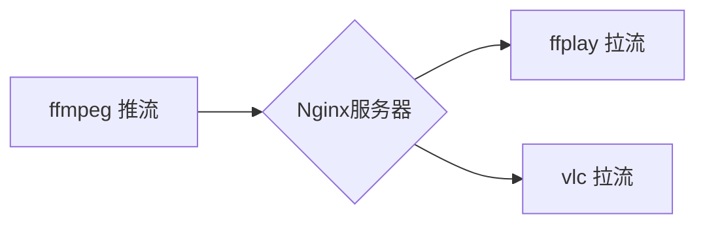

# nginx+rtmp+ffmpeg搭建直播服务

# nginx

1、到[nginx.org](http://nginx.org/) 下载稳定版本的nginx

2、到 https://github.com/arut/nginx-rtmp-module 下载rtmp模块

`git clone https://github.com/arut/nginx-rtmp-module.git`

3、编译Nginx，如果已经编译过，需要指定nginx-rtmp-module重新编译。

`./configure --add-module=<path>/nginx-rtmp-module`

https://github.com/arut/nginx-rtmp-module 有编译说明。

# nginx添加rtmp配置
nginx配置文件位于/usr/local/nginx/conf/nginx.conf
```text
rtmp {
	server {
		listen 1935;
		application live {
			live on;
		}
	}
}
```
# ffmpeg推流和拉流

## 启动或重启nginx服务：

`sudo /usr/local/nginx/sbin/nginx`
或
`sudo systemctl restart nginx`

## 推流：

**1）摄像头：**
`ffmpeg -i /dev/video0 -an -f flv rtmp://127.0.0.1/live`
-an 参数是去掉音频，如果需要的话可以去掉，live对应的是nginx配置文件中application的名称。

**2）播放文件：**
`ffmpeg -re -i AVC_high_1280x720_2013.mp4 -c copy -f flv rtmp://127.0.0.1/live`

**3）使用OBS Studio**

**4）配合rtmpdump**
`ffmpeg -re -i AVC_high_1280x720_2013.mp4 -c copy -f flv rtmp://127.0.0.1/live/play`

## 拉流：

**1）使用ffplay**

`ffplay rtmp://127.0.0.1/live`

**2）使用vlc播放**

**3）配合rtmpdump**
`rtmpdump -r rtmp://127.0.0.1/live/play | vlc -`
服务器 URL
具有以下格式：
protocol://servername:port/appName/appInstance	
rtmp://localhost:1935/testapp/instance1


# 整体框架




